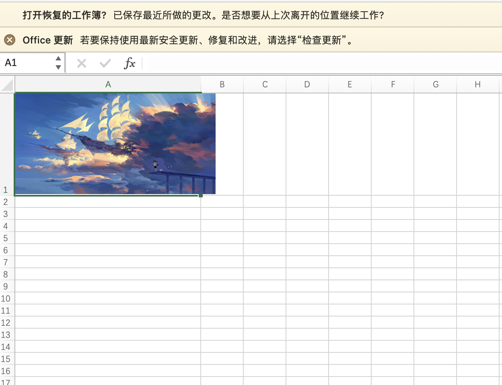

```golang
package main

import (
	"fmt"
	"image"
	"io/ioutil"
	"os"

	_ "image/gif"
	_ "image/jpeg"
	"image/png"

	"github.com/360EntSecGroup-Skylar/excelize"
	"github.com/nfnt/resize"
)

func main() {
	// 打开原始图片
	originImage, errf := os.Open("image.png")
	if errf != nil {
		fmt.Printf("打开图片错误：%s \n", errf.Error())
		return
	}
	defer originImage.Close()

	// 获取原始图片尺寸
	imageDecode, _, err1 := image.Decode(originImage)
	if err1 != nil {
		fmt.Printf("获取图片错误：%s \n", err1.Error())
		return
	}
	b := imageDecode.Bounds()
	width := b.Max.X
	height := b.Max.Y
	fmt.Printf("图片宽度：%+v 像素; 高度：%+v 像素 \n", width, height)

	// 获取高/宽的比例
	rate := float32(height) / float32(width)

	// 设置图片缩略图宽度为300，按照原图比例设置图片缩略图高度
	thumbnailWeight := 300
	thumbnailHeight := rate * float32(thumbnailWeight)

	fmt.Println(thumbnailWeight, thumbnailHeight)

	// 生成缩略图
	thumbnailImage := resize.Resize(uint(thumbnailWeight), uint(thumbnailHeight), imageDecode, resize.Lanczos3)

	// 需要保存临时文件
	thumbnailfile, _ := os.Create("thumbnail_tmp.png")
	defer func() {
		// 删除临时文件
		os.Remove("thumbnail_tmp.png")
		thumbnailfile.Close()
	}()
	// 设置缩略图为png格式
	png.Encode(thumbnailfile, thumbnailImage)

	f := excelize.NewFile()
	// 设置图片放置单元格的宽高
	// 列宽是以英寸为单位,1英寸 约为96.52像素
	// 行高以磅为单位，1磅 约为1.34039像素
	excelWidth := float32(thumbnailWeight) / 8
	f.SetColWidth("Sheet1", "A", "A", float64(excelWidth)+1) // 放置图片出单元格，宽、高设置都+1
	excelHeight := float32(thumbnailHeight) / 1.34039
	f.SetRowHeight("Sheet1", 1, float64(excelHeight)+1)

	file, err := ioutil.ReadFile("thumbnail_tmp.png")
	if err != nil {
		fmt.Println(err)
	}

	// 图片写入excel
	if err := f.AddPictureFromBytes("Sheet1", "A1", `{
        "positioning": "absolute" 
    }`, "Logo", ".png", file); err != nil { // 设置图片大小固定，不随单元格的缩放最变动
		fmt.Printf("添加图片错误：%s \n ", err.Error())
	}

	if err := f.SaveAs("book.xlsx"); err != nil {
		fmt.Printf("保存图片错误：%s \n", err.Error())
	}
}

```


其实现效果如下：


